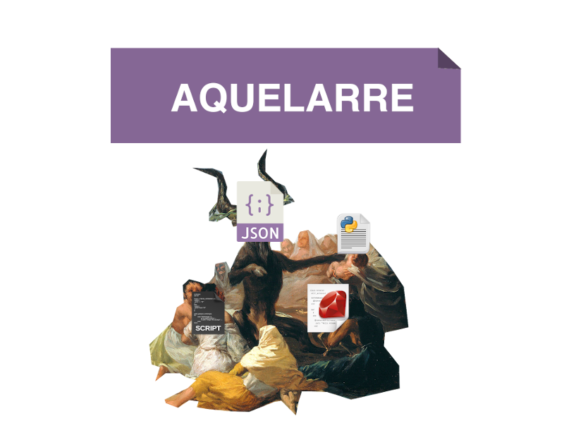

[](https://shields.io/)
[](https://www.python.org/)
[](https://www.gnu.org/software/bash/)
[](https://opensource.org/licenses/MIT)

# Aquelarre

Aquelarre is a DSL (with an interpreter) for making minimalistic web apps. It's more minimalistic 
than similiar software beacuse:

* Only implements: GET, POST, PUT, PATCH and DELETE HTTP methods.
* Each request is proccesed by a custom script (of any language), it's 
parameters are passed as script parameters and it's body JSON payload as stdin.
* Responses are in JSON format only, must be the stdout of a script.

## Concept 
Usually when developing web apps the common frameworks include everything you need, like serializers, ORM, etc. the cost  
of this is having some extra boilerplate code and perhaps a learning curve. Also, you have to stick to the one language that 
the framework was written.  
With aquelarre you write a script and redirect the URLs to another scripts of any language, so you can work with a lot of different 
libs. You decide how to serialize data and how to store it in a database, it could be just plain .txt, .cvs, .json, a relational db or whatever you want.  

## Installing
1. Clone the repo and go to it: 
```sh
$ git clone https://github.com/domandlj/aquelarre.git 
$ cd aquelarre
```
2. Run the installer (only works with Mac OS, Linux and Termux.).
```sh
$ chmod +x install.sh
$ sudo ./install.sh
``` 

3. And that's it, you can now run your own aquelare .re scripts like
```sh
$ aquelarre script.re
```
the Aquelarre prompt will be started:
```sh
> 🐐 Aquelarre server started http://localhost:8080

```
and you can now remove the github repo if you want. 

4. You can run again the install script to remove Aquelarre. 

## Syntax example
script.re
```ruby
#!/usr/local/bin/aquelarre

exists_worker = scripts/exists_worker.py
get_worker = scripts/get_worker.py
anything = scripts/anything.sh
fail = scripts/fail.py
create_worker = scripts/create_worker.py

get / : 
     anything => home, 200 
end

get /?id&name :
    # succes.
        exists_worker => get_worker, 201 
    # failure.
	not exists_worker => fail, 400
end

post / : 
	not exists_worker => create_worker, 201
end
```
Now you can execute the script with aquelarre interpreter, like:
`$ aquelarre script.re`
Or running it like an script, but first you give it permissions:  
```
$ chmod +x script.re  
$ ./script.re  
```
When the client makes an HTTP request to an URL, the parameters and arguments must be in a query style:  
`/resource?parameter1=value1&parameter2=value2`   
Other ways like this:    
`/resource/value1`   
are not allowed.   


## Implementation.
The server is implemented with `httt.server` Python lib which isn't recommended for production, so one of this days 
i'm going to implement it with some WSGI compatible server.
Also there are no tests yet.

## License
MIT License (© 2021 Juan Salvador Domandl).

